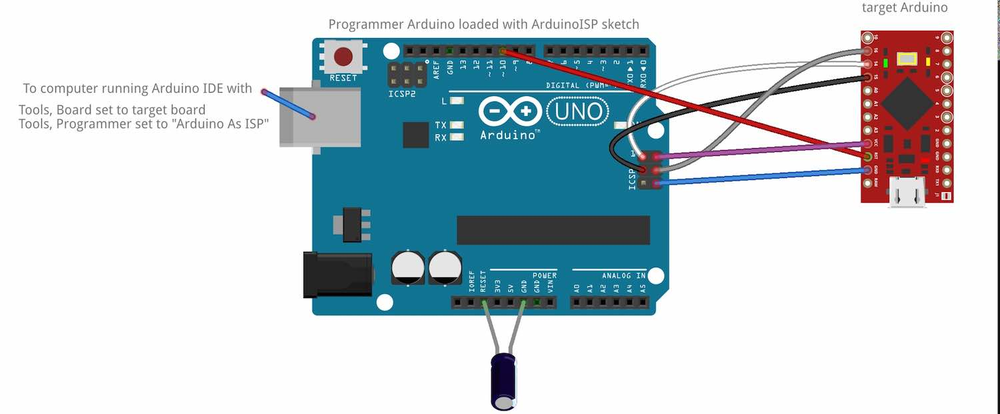

# Dactyl

## falshing pro micro DFU-QMK bootloader and seting fuses so its not stuck in DFU mode

 no cap needed

    avrdude.exe -p atmega32u4 -c stk500v1 -b 19200 -U lfuse:w:0x5e:m -U hfuse:w:0x99:m -U efuse:w:0xf3:m -U flash:w:"bootloader/promicro_dfu.hex":i -P PROGRAMMER_COM_PORT

## env setup

https://beta.docs.qmk.fm/newbs/newbs_getting_started

## programming layout, has to be run for each side

    make handwired/dactyl_manuform/5x6:default:dfu

main side is defined by

    #define MASTER_LEFT in config.h

and the master becomes the side to which the USB is connected to.
