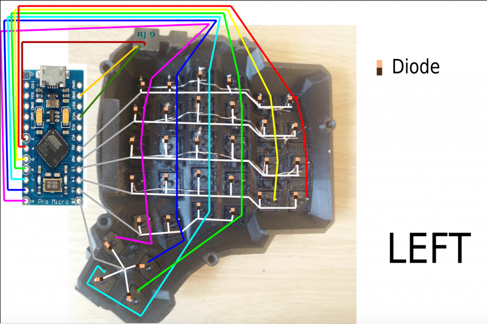
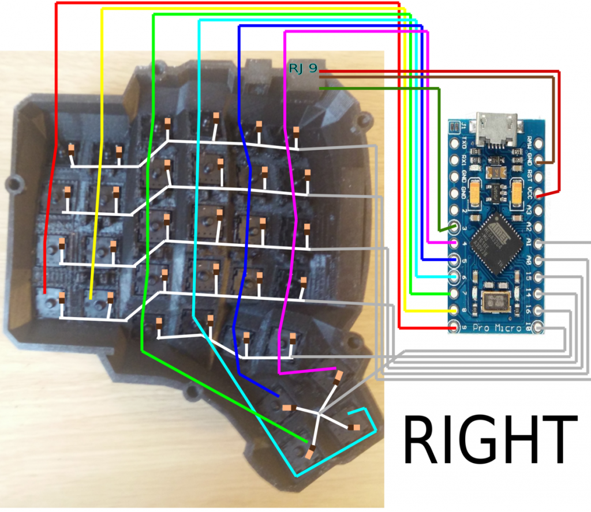

# Dactyl

## falshing pro micro DFU-QMK bootloader and seting fuses so its not stuck in DFU mode

 no cap needed

    avrdude.exe -p atmega32u4 -c stk500v1 -b 19200 -U lfuse:w:0x5e:m -U hfuse:w:0x99:m -U efuse:w:0xf3:m -U flash:w:"bootloader/promicro_dfu.hex":i -P PROGRAMMER_COM_PORT

## env setup

https://beta.docs.qmk.fm/newbs/newbs_getting_started

## programming layout, has to be run for each side 

    make handwired/dactyl_promicro:default:dfu-split-left
	make handwired/dactyl_promicro:default:dfu-split-right

main side is defined by

    #define MASTER_LEFT in config.h

and the master becomes the side to which the USB is connected to.

## Required Hardware

Apart from diodes and key switches for the keyboard matrix in each half, you
will need:

- 2 Arduino Pro Micros. You can find these on AliExpress for ≈3.50USD each.
- 2 TRRS sockets and 1 TRRS cable, or 2 TRS sockets and 1 TRS cable

Alternatively, you can use any sort of cable and socket that has at least 3
wires. If you want to use I2C to communicate between halves, you will need a
cable with at least 4 wires and 2x 4.7kΩ pull-up resistors

## Optional Hardware

A speaker can be hooked-up to either side to the `5` (`C6`) pin and `GND`, and turned on via `AUDIO_ENABLE`.

## Wiring



--------------------------------------------------------------------------------------
The 3 wires of the TRS/TRRS cable need to connect GND, VCC, and digital pin 3 (i.e.
PD0 on the ATmega32u4) between the two Pro Micros.

Next, wire your key matrix to any of the remaining 17 IO pins of the pro micro
and modify the `matrix.c` accordingly.

The wiring for serial:


The wiring for i2c:


The pull-up resistors may be placed on either half. It is also possible
to use 4 resistors and have the pull-ups in both halves, but this is
unnecessary in simple use cases.

You can change your configuration between serial and i2c by modifying your `config.h` file.

## Notes on Software Configuration

the keymaps in here are for the 4x5 layout of the keyboard only.

## Flashing

To flash your firmware take a look at: [Flashing Instructions and Bootloader Information](https://docs.qmk.fm/#/flashing)

## Choosing which board to plug the USB cable into (choosing Master)

Because the two boards are identical, the firmware has logic to differentiate the left and right board.

It uses two strategies to figure things out: looking at the EEPROM (memory on the chip) or looking if the current board has the usb cable.

The EEPROM approach requires additional setup (flashing the eeprom) but allows you to swap the usb cable to either side.

The USB cable approach is easier to setup and if you just want the usb cable on the left board, you do not need to do anything extra.

### Setting the left hand as master

If you always plug the usb cable into the left board, nothing extra is needed as this is the default. Comment out `EE_HANDS` and comment out `I2C_MASTER_RIGHT` or `MASTER_RIGHT` if for some reason it was set.

### Setting the right hand as master

If you always plug the usb cable into the right board, add an extra flag to your `config.h`

```
 #define MASTER_RIGHT
```

### Setting EE_hands to use either hands as master

If you define `EE_HANDS` in your `config.h`, you will need to set the
EEPROM for the left and right halves.

The EEPROM is used to store whether the
half is left handed or right handed. This makes it so that the same firmware
file will run on both hands instead of having to flash left and right handed
versions of the firmware to each half. To flash the EEPROM file for the left
half run:

```
make handwired/dactyl_promicro:default:dfu-split-left
make handwired/dactyl_promicro:default:dfu-split-right
```

After you have flashed the EEPROM, you then need to set `EE_HANDS` in your config.h, rebuild the hex files and reflash.

Note that you need to program both halves, but you have the option of using
different keymaps for each half. You could program the left half with a QWERTY
layout and the right half with a Colemak layout using bootmagic's default layout option.
Then if you connect the left half to a computer by USB the keyboard will use QWERTY and Colemak when the
right half is connected.
